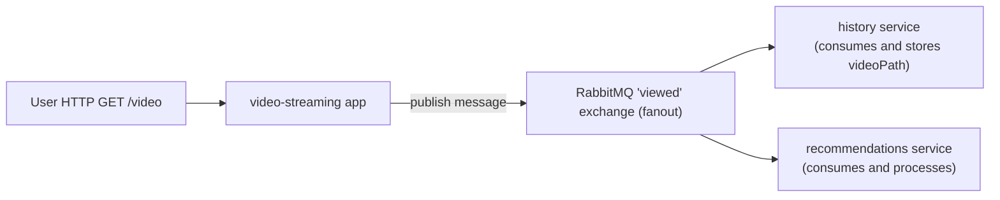

# Example-4

Example number 4 from Chapter 5 of [Bootstrapping Microservices](https://www.bootstrapping-microservices.com).

In Chapter 5 of Bootstrapping Microservices you learn how to make microservices talk to each other with HTTP requests and RabbitMQ messages.

You need Docker and Docker-Compose installed to run this.

Boot it up from the terminal using:

    docker-compose up --build

